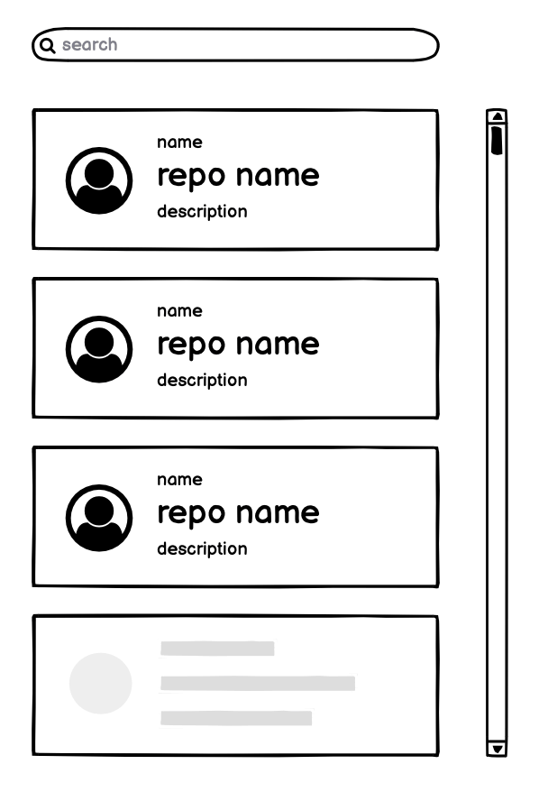

## 目標

- 使用 Github api 查詢相關 repos
  - 避免過於頻繁的 API requests
- 換頁時以 infinite scroll 呈現

demo [github-repositories-search](https://searchgithubrepos.hidana.me)



## 資料夾結構

此專案是基於 react with typescript 開發

```
├── src/
    ├── components/ 元件
    ├── pages/ 呈現頁面
    ├── services/ api 串接
    ├── types/ 型別
    ├── utils/ 一些常數或是 fun 設定
    ...
...
├── package-lock.json
├── package.json
├── README.md
└── tsconfig.json
```

## 使用此專案

```
$ npm i
$ npm start
```

## 部署此專案

```
$ vercel --prod
```
